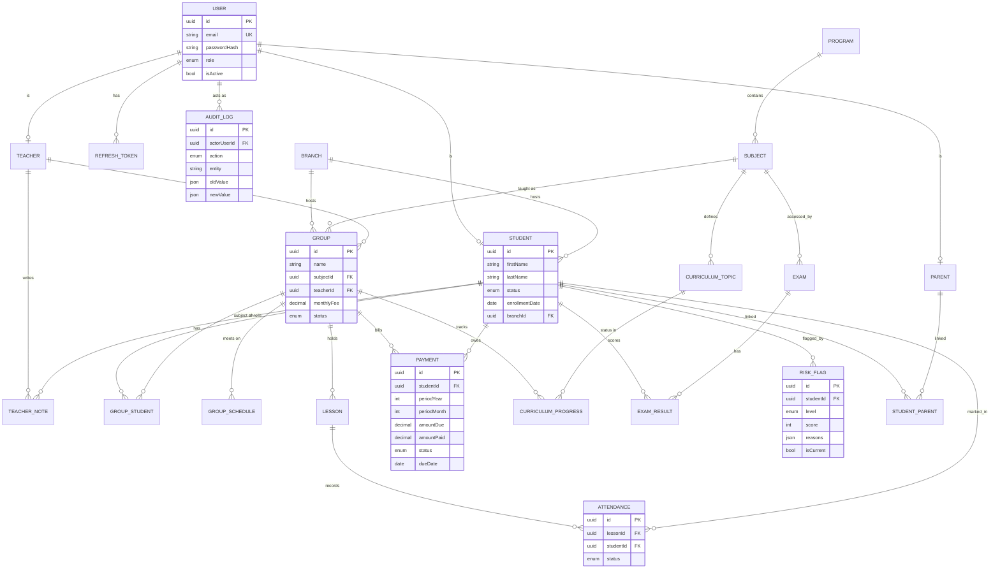

# EOS — ER Diagram

Rendered with Mermaid (GitHub renders this natively).

> The full attribute list for every table lives in
> `backend/prisma/schema.prisma`. The diagram above shows cardinalities and the
> key attributes that drive the product's questions.
